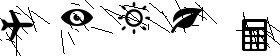
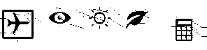

# BBBot

BBBot é um bot que realiza votações no [Big Brother Brasil 19](https://gshow.globo.com/realities/bbb/). Esse projeto faz parte de um estudo pessoal sobre segurança da informação e processamento de imagem.

O projeto foi testado no MacOS 10.14.3 e no Ubuntu 18.04

## Começando os trabalhos

### Pré-requisitos

* [Python3](https://www.python.org/)   
```
sudo apt-get install python3
```
* [Selenium](https://www.seleniumhq.org/) para simular a navegação 
```
sudo pip3 install selenium
```
* [OpenCV](https://opencv.org/) para o processamento de imagem do captcha
```
sudo pip3 install opencv-python
```
* [Mozilla Firefox](https://www.mozilla.org/pt-BR/firefox/new/) é o navegador que será usado
* [Geckodriver](https://github.com/mozilla/geckodriver/releases)
```
wget https://github.com/mozilla/geckodriver/releases/download/v0.18.0/geckodriver-v0.18.0-linux64.tar.gz
tar -xvzf geckodriver*
chmod +x geckodriver
sudo mv geckodriver /usr/local/bin/
```

### Utilizando o bot
Depois de instalar os pré-requisitos necessários, podemos clonar o repositório na pasta de preferência:

```
git clone https://github.com/izmcm/BBBot.git
```
As variáveis **url** e **nameSearch** devem ser trocadas, respectivamente, para o url de votação do site da Globo e para o nome da pessoa que será votada (da forma como se encontra escrito no site de votação).

Após isso, podemos caminhar até a pasta para rodar o projeto:
```
python3 script.py
```

Nesse momento, o Firefox abrirá automaticamente na página de votação e será necessário fazer o login no site. Após o login ser realizado, o programa se encarregará de votar na pessoa escolhida em **nomeSearch** e passar pelo captcha sozinho.

#### Demo


## Como funciona?

O funcionamento do programa pode ser dividido em duas partes: simulação de uso do navegador com [Selenium](https://www.seleniumhq.org/) e processamento do captcha com [OpenCV](https://opencv.org/).

### 1. Simulação de uso do navegador
Selenium é uma das muitas ferramentas usadas para realizar testes em aplicativos web e, com isso, pode realizar simulações de uso de um navegador como o Firefox. Para realizar essas simulações, ele basicamente interage com o html da página web.

Em vários momentos do [script.py](script.py), é possivel ver o Selenium capturando elementos da página a partir de suas classes ou IDs, como em:

```
13  | singin = firefox.find_elements_by_class_name('barra-botao-entrar')[0].click()
... | 
81  | captcha = firefox.find_element_by_id("glb-challenge-image")
```

É importante observar que os elementos são buscados na forma abaixo para evitar que oscilações na velocidade de carregamento da página quebrem o script. Assim, o programa continua procurando pelo elemento até ele que ele consiga carregar completamente.
```
while(1):
  try:
    title = firefox.find_elements_by_class_name('glb-poll-question')[0].text
    break
  except:
    pass
```

Os delays, representados por `time.sleep()`, funcionam com o mesmo propósito.

### 2. Processamento do captcha
A parte de processamento de imagem pode ser vista em [processing.py](processing.py). Nele, há duas funções: processImage() e findInCaptcha()

#### processImage()
Nessa função, é realizado o processamento do captcha por meio do método [Dilate](https://docs.opencv.org/2.4/doc/tutorials/imgproc/erosion_dilatation/erosion_dilatation.html) de [OpenCV](https://opencv.org/). 

A função desse código é deixar as linhas da imagem mais leves para poder capturá-la com mais precisão como pode ser visto abaixo:

Antes                        |  Depois
:---------------------------:|:---------------------------:
 |  

Depois de realizar o processamento, cada imagem foi cortada a mão para conseguir o elemento da resposta correta e salvá-lo em [elementsCaptcha](elementsCaptcha) que funcionou como o dataset.

#### findInCaptcha()
Aqui, a imagem salva em elementsCaptcha é usada como referência para buscar o elemento pedido em qualquer outro captcha. Tudo isso é feito com o método [matchTemplate](https://docs.opencv.org/2.4.13.7/doc/tutorials/imgproc/histograms/template_matching/template_matching.html). 

##### É importante observar que isso só é possível porque as imagens de cada elemento são sempre as mesmas.

Os resultados dessa etapa podem ser vistos abaixo ou em [matchCaptcha](matchCaptcha).

Captcha                                 |  Elemento                               |  Match
:--------------------------------------:|:---------------------------------------:|:--------------------------------:
 |   | 

Por fim, a função retorna a localização do elemento no captcha para o [script.py](script.py). Lá, o Selenium se encarrega de fazer o clique na posição certa da imagem.

###### Mais sobre processamento de imagem em captchas pode ser visto em [Captcha Break](https://github.com/izmcm/captcha-break)

## Licença

A licença do projeto é MIT License - olhar [LICENSE.md](LICENSE.md) para mais detalhes.

